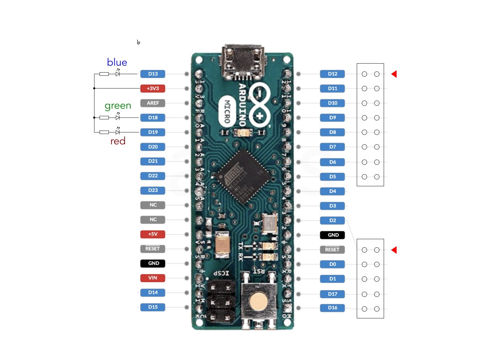

# Eurorack Power Cable Tester

This Arduino-based tool helps test Eurorack power cables for shorts and continuity problems.

[video](https://x.com/pst723/status/1898565106822185207)

## Hardware

The tester uses an Arduino Micro with:
- Two pin headers to connect to both ends of the IDC cable
- RGB LED for status indication




### RGB LED (optional)
- Red (D19): Indicates shorts
- Green (D18): Indicates all tests passed
- Blue (D13): Indicates missing connections

## Usage

1. Connect the Arduino Micro to your computer via USB
2. Upload the provided sketch to the Arduino Micro
3. Connect the two ends of a Eurorack power cable to the headers
4. Check the RGB LED for immediate visual feedback:
   - Green: All connections good
   - Red: Short circuit detected
   - Blue: Missing connection(s)
5. For detailed feedback, connect to the Arduino's serial port

### Viewing Serial Output

For detailed test results, you can use a terminal emulator to view the serial output:

#### Using Minicom (Linux/macOS)

```bash
# Install minicom if not already installed
# On Ubuntu/Debian:
sudo apt-get install minicom

# On macOS with Homebrew:
brew install minicom

# Connect to the Arduino (use Arduino's serial port device)
minicom -D /dev/cu.usbmodem11101
```


#### Using PuTTY (Windows)

1. Download and install PuTTY
2. Open PuTTY
3. Select "Serial" as the connection type
4. Enter the COM port (e.g., COM3)
5. Click "Open"

## Serial Output Format

The serial output provides a visual representation of the pin headers and lists any problems detected:

```
+--+    +--+
|oo|====|oo|
|oo|====|oo|
|oo|====|oo|
|XX|    |XX|
|oo|====|oo|
|oo|    +--+
|oo|
|oo|
+--+

TEST RESULT: MISSING CONNECTIONS
OPEN: D10 -> D1
OPEN: D1 -> D10
```

### Diagram Legend

- `oo`: Normal pin
- `XX`: Open connection (no continuity)
- `!!`: Short to another pin
- `====`: Good connection
- `    `: Broken connection
